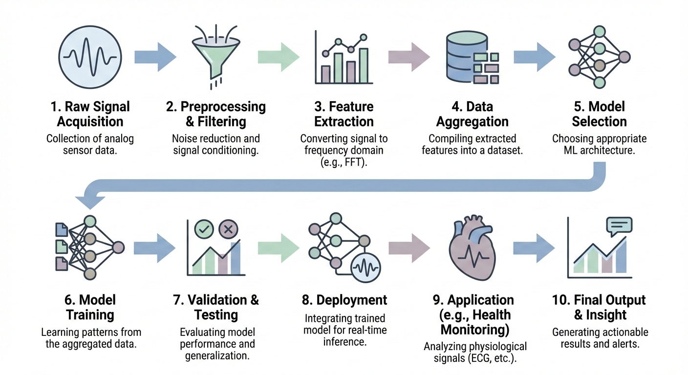

# ECG Anomaly Detection

A comprehensive machine learning framework for detecting cardiac anomalies in electrocardiogram (ECG) signals using advanced signal processing and deep learning techniques.

---

## Abstract

This project implements an end-to-end pipeline for ECG-based cardiac anomaly detection, combining robust signal preprocessing with multiple deep learning paradigms. It integrates:

- **Unsupervised Autoencoders** for reconstruction-based anomaly scoring  
- **Supervised Sequence Models** (LSTM, Bi-LSTM, GRU, CNN-LSTM) for binary classification  

The framework achieves very high sensitivity in detecting pathological cardiac patterns while preserving specificity on normal signals, reaching up to **99.9% accuracy** with state-of-the-art architectures.

---

## Contents

1. [Overview](#overview)  
2. [System Architecture](#system-architecture)  
3. [Methodology](#methodology)  
4. [Project Structure](#project-structure)  
5. [Key Results](#key-results)  
6. [Design Rationale](#design-rationale)  
7. [Clinical Significance](#clinical-significance)  
8. [Technical Specifications](#technical-specifications)  
9. [Citation](#citation)

---

## Overview

ECG signals are noisy, highly variable, and morphologically complex. This project addresses these challenges through a two-stage pipeline:

- **Stage 1 – Preprocessing & Feature Engineering:**  
  Cleans raw ECG signals, normalizes them, and extracts clinically meaningful features.
- **Stage 2 – Deep Learning Models:**  
  Applies unsupervised and supervised models for anomaly detection.

The framework is modular, reproducible, and suitable for both research and clinical experimentation.

---

## System Architecture

### End-to-End Pipeline

